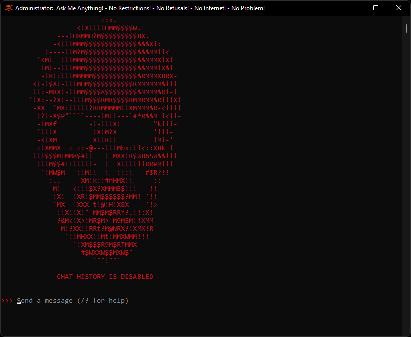

# Ollama-Windows-V.1
 
> Run a fully offline, zero-history LLM on Windows using Ollama — no cloud, no logs, no telemetry.
 
---
 
## Overview
 
This guide walks you through installing Ollama on Windows, creating a custom model with a system prompt, and setting up a desktop shortcut so you can launch your local LLM with a double-click. Every session starts fresh with zero history.
 
---
 
## Prerequisites
 
- Windows 10 or 11
- Command Prompt or PowerShell
- An internet connection for the initial setup (after that, fully offline)
---
 
## Step 1 — Install Ollama
 
Open Command Prompt and run:
 
```cmd
curl -L "https://ollama.com/download/OllamaSetup.exe" -o "%TEMP%\OllamaSetup.exe" && "%TEMP%\OllamaSetup.exe"
```
 
Follow the installer, then verify it worked:
 
```cmd
ollama --version
```
 
---
 
## Step 2 — Pull Your Model
 
Replace `MODEL_NAME` with whichever model you want (e.g. `llama3`, `mistral`, `gemma3`, `phi3`):
 
```cmd
ollama pull MODEL_NAME
```
 
Browse available models at [ollama.com/library](https://ollama.com/library).
 
---
 
## Step 3 — Create the Modelfile **You can skip making a modelfile if you don't want a "prompt injected" model.
 
A Modelfile lets you bake a system prompt into a custom model so it starts every session with your instructions already loaded.
 
Create a new text file at `C:\` named exactly:
 
```
modelfile
```
 
> **Important:** No file extension — the file should be named `modelfile`, not `modelfile.txt`. In File Explorer, make sure file extensions are visible under View → Show → File name extensions so you can confirm there's no `.txt` on the end.
 
Open the file and paste the following, replacing `MODEL_NAME` with your model and writing your system prompt inside the quotes:
 
```
FROM MODEL_NAME
SYSTEM "Your prompt injection goes here."
```
 
**Example:**
 
```
FROM mistral
SYSTEM "You are a helpful assistant. Be concise and direct. Never mention that you are an AI."
```
Follow the link for a collection of prompt injections for various models: [Prompt Injections](https://github.com/elder-plinius/L1B3RT4S) 

Save and close the file. (Make sure the file is saved in `C:\` for this next step.
 
---
 
## Step 4 — Create Your Custom Model
 
Open Command Prompt and navigate to `C:\`:
 
```cmd
cd /d C:\
```
 
Create the custom model, replacing `CUSTOM_MODEL_NAME` with whatever you want to call it:
 
```cmd
ollama create CUSTOM_MODEL_NAME -f ./modelfile
```
 
Verify it was created:
 
```cmd
ollama list
```
 
---
 
## Step 5 — Run It
 
```cmd
ollama run CUSTOM_MODEL_NAME
ollama run MODEL_NAME <- (If you're running a base model).
```
 
Type your questions and press Enter. Use `/bye` or `Ctrl+C` to exit.
 
---
 
## Step 6 — Desktop Shortcut (Optional but Recommended)
 
Instead of opening Command Prompt every time or using the ollama GUI, create a `.bat` file you can double-click from your desktop.
 
Create a new text file anywhere, open it, and paste the following — replacing `CUSTOM_MODEL_NAME` with your model name:
 
```bat
@echo off
title CUSTOM_MODEL_NAME
set OLLAMA_NOHISTORY=1
ollama run CUSTOM_MODEL_NAME
pause
```
 
Save and close the file, then rename it from `filename.txt` to `filename.bat`.
 
> **Tip:** To rename the extension in File Explorer, make sure file extensions are visible (View → Show → File name extensions), then right-click → Rename and change `.txt` to `.bat`.
 
Double-click the `.bat` file to launch your model in a terminal window. Every session starts fresh — no history is saved.
 
Move it to your Desktop for easy access.
 
---
 
## How It Works
 
| Feature | Detail |
|---|---|
| **Zero history** | `OLLAMA_NOHISTORY=1` ensures nothing is logged between sessions |
| **System prompt** | Baked into the model at creation — loads automatically every run |
| **Fully offline** | After the initial pull, no internet connection is needed |
| **One-click launch** | The `.bat` file opens a terminal and starts the model instantly |
 
---
 
## Customization Tips
 
- **Change the system prompt** — edit the `modelfile` and re-run `ollama create` with the same name to overwrite it
- **Multiple personalities** — create several modelfiles and `.bat` files for different use cases (e.g. a coding assistant, a writing assistant, a research assistant)
- **Window title** — change `title CUSTOM_MODEL_NAME` in the `.bat` file to label the terminal window however you like
---
 
## Files Overview
 
```
C:\
└── modelfile                    # Defines the base model and system prompt
 
Desktop\
└── CUSTOM_MODEL_NAME.bat        # Double-click launcher with zero history
```


 
---
 
## Related
 
- [RAG-Technique-V.1](https://github.com/quintenlittle/RAG-Technique-V.1) — Index your personal files and query them with a local LLM

---
